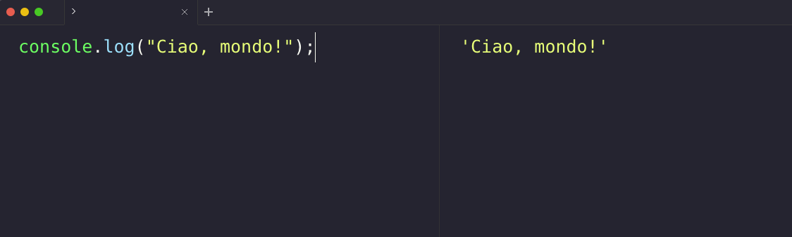

# Introduzione pratica a JavaScript

Argomenti: Storia di JavaScript, Hello World!

## Intro

JavaScript è un linguaggio di programmazione versatile e dinamico, essenziale per lo sviluppo di applicazioni web moderne.

Creato da [Brendan Eich](https://it.wikipedia.org/wiki/Brendan_Eich) nel 1995, JavaScript ha rapidamente guadagnato popolarità ed è oggi impiegato da milioni di sviluppatori globalmente. La sua principale forza risiede nella capacità di arricchire le pagine web con funzionalità interattive senza il bisogno di ricaricare la pagina.

## Perché Imparare JavaScript?
Il motivo principale per imparare JavaScript è la sua capacità di interagire dinamicamente con gli elementi di una pagina web. Per esempio, JavaScript permette di modificare il colore di un pulsante quando l'utente ci passa sopra con il mouse, o di validare i dati inseriti in un modulo prima che vengano inviati al server. Questo tipo di interazione rende le applicazioni web più intuitive e reattive, migliorando significativamente l'esperienza utente.

## Come Iniziare con JavaScript?
Per scrivere e testare codice JavaScript, è essenziale avere a disposizione un buon ambiente di sviluppo. Consigliamo l'uso di [Visual Studio Code](https://code.visualstudio.com/), un editor di testo avanzato e gratuito che supporta numerose estensioni, tra cui quelle specifiche per JavaScript, che possono aiutare a scrivere codice più pulito e funzionale.

Per eseguire codice JavaScript in modo efficace e vedere i risultati in tempo reale, si può utilizzare [RunJS](https://runjs.app/), un'applicazione desktop che fornisce un ambiente isolato dove inserire ed eseguire il tuo codice. Questo strumento è particolarmente utile per gli sviluppatori alle prime armi poiché permette di visualizzare immediatamente l'effetto delle modifiche apportate al codice.


## Esercizio

Ecco un esempio di codice JavaScript che puoi inserire in RunJS per testare il tuo ambiente di sviluppo:
Obiettivo:
Testa il tuo ambiente di sviluppo JavaScript assicurandoti che sia configurato correttamente.

Istruzioni:
1. Apri RunJS, che è un'applicazione per eseguire codice JavaScript.
2. Nel pannello a sinistra, chiamato "Editor", copia e incolla il seguente codice:

```jsx
// questo è un commento, viene ignorato dal programma
// Qui sotto utilizziamo la funzione console.log per stampare il messaggio "Ciao, mondo!" nella console
console.log("Ciao, mondo!"); 
```
3.Guarda il pannello a destra, denominato "Console", per vedere il risultato del codice eseguito. Dovresti vedere stampato il messaggio "Ciao, mondo!".




**Congratulazioni! 🎉** 

Hai appena eseguito il tuo primo codice JavaScript utilizzando RunJS. 
